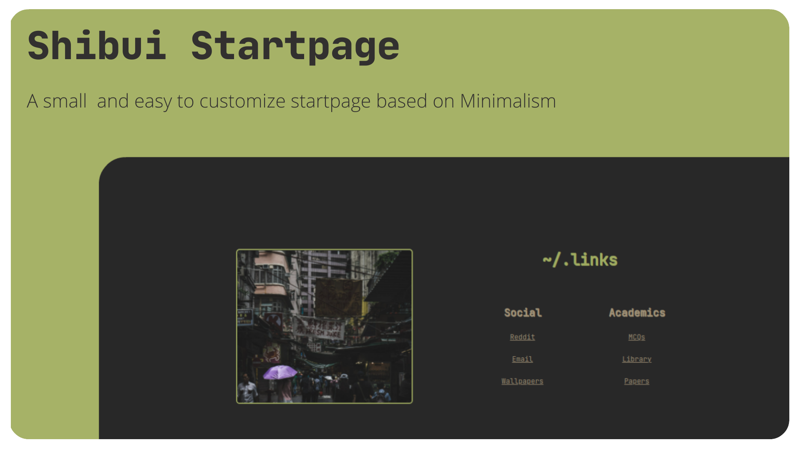

### Index 📃
---
1. [Index 📃](https://github.com/Deottive/Shibui.page#index-)
2. [Why I made this ❓](https://github.com/Deottive/Shibui.page#why-i-made-this-)
3. [Usage 🏯](https://github.com/Deottive/Shibui.page#usage-) 
	1.  [As a Home Page 🏠](https://github.com/Deottive/Shibui.page#as-a-home-page-)
	2.  [As a New Tab page ➕](https://github.com/Deottive/Shibui.page#as-a-new-tab-page-) 
4.  [Customization 🌴](https://github.com/Deottive/Shibui.page#customizations-)
	1.  [Changing the colors 🖌️](https://github.com/Deottive/Shibui.page#changing-the-colors-%EF%B8%8F)
	2.  [Changing the Images 🖼️](https://github.com/Deottive/Shibui.page#changing-the-image-%EF%B8%8F)
	3.  [Adding your Links 🔗](https://github.com/Deottive/Shibui.page#adding-your-links--)
5.  [Disclaimer ⚠️](https://github.com/Deottive/Shibui.page#disclaimer-%EF%B8%8F)
6.  [Features](https://github.com/Deottive/Shibui.page#features-)

#### Why I made this ❓
This is just a simple project which I am making for myself as I have opted for Bacheloers in **IT** and wanted to get a simple project during vacations, I have made this in a day and so here it is, Just a Simple Webpage which can be installed as an Extension and can be used as *New tab page* and a *Home page*. 

#### Usage 🏯
##### As a Home Page 🏠
1. Clone this repo in your favourite folder
	1. *tip : you should have a folder named **Clone** where you stored all the cloned repos*
2. For Brave / Chrome / Edge 
	1. Go to Settings 
	2. Search Home or 
	3. You can just search this   `brave://settings/?search=home`
	4. Select Show home page 
	5. Enter a custom address 
	6. Navigate to the index.html in the folder you cloned 
3. If you use firefox you can search on the web as I dont use Firefox Browser 

##### As a New tab page ➕ 
1. Clone this repo in your favourite folder 
2. Go to your favourite browser 
3. Search extensions or 
4. Just search this   `browser-name://extensions/`
5. Enable developer mode 
6. Select the opetion to Load the extension 
7. Navigate to the repo folder 

#### Customizations 🌴
##### Changing the Colors 🖌️
1. Open the Repo or the Cloned folder in your favourite text editor 
2. Edit the Styles.css file 
	1. In the body section edit the background-color 
	2. Pretty simple right 
##### Changing the Image 🖼️
1. Open the Repo or the Cloned folder in your favourite text editor
2. Add your favourite image to the `images/` folder 
3. Edit the index.html file 
	1. In the body section
	2. Edit the ``
		1. Remove japan-rain.jpg with the name of your file
##### Adding your Links  🔗
1. Open the Repo or the Cloned folder in your favourite text editor
2. Go to the `<table>` tag 
	1. In this change the href part to the link that you want

#### Disclaimer ⚠️
- This is a very first startpage which I have made 
- This is not very dynamic and is not very flexible 
- You probably have to change the size of the page or zoom in or out to fix the resolution or you know the look 
- This is made plasting margins and padding all over the page 
#### Features 🌠
- Fast 
- Easy to change and customize 
- Looks really minimal and cool 
- Not that many
